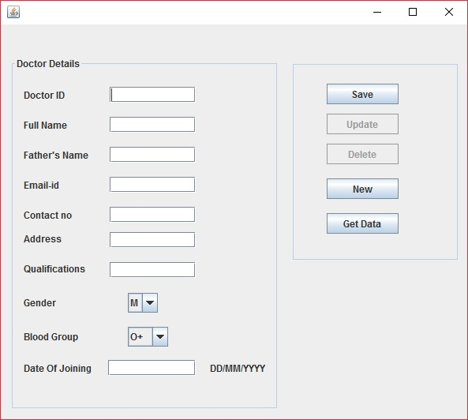
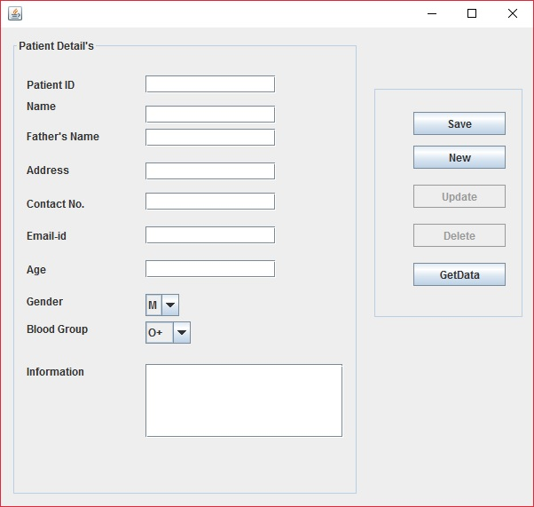
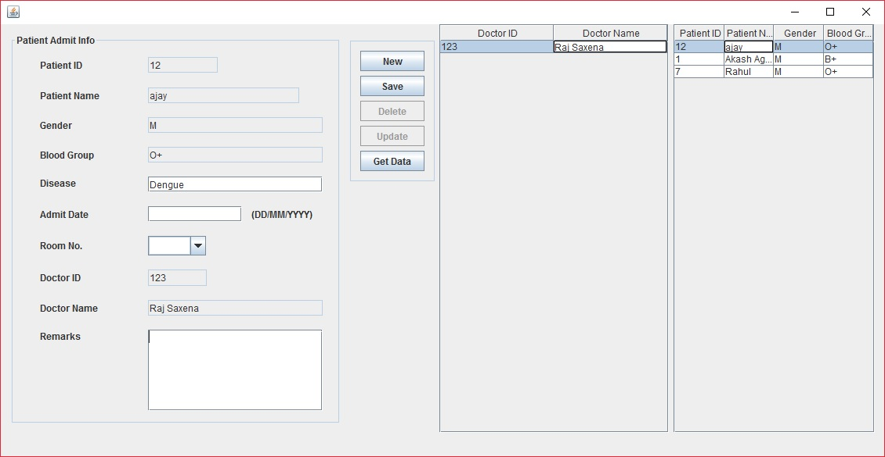
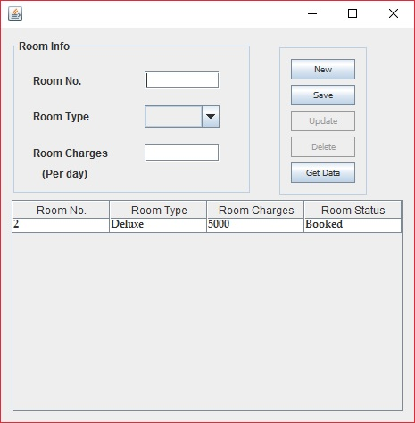
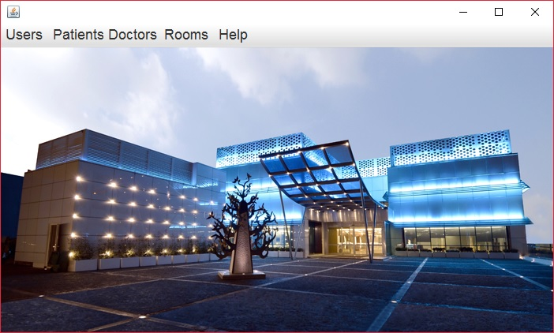

# Hospital Management System   
A desktop application written in Java for a Hospital Management System. 
A project made in class-12 (CBSE-Informatics and Practices). 
* Provides password protected Admin panel.
* MySql for backend
* Sleek interface
* Record of Patients,Doctors and additional facilities such as rooms and billing.

## Screenshots

## Getting started :computer:
* To get the database first create a database in MySql
and then put the [hp_mgmt_db.sql](https://github.com/agarwal-akash/Hospital-Management/blob/master/hp_mgmt_db.sql) dump file in your MyMySQL Server5.1/bin directory.
Now in command prompt enter:
  * cd program files/MySQL/MySQL Server5.1/bin “press enter"
  * mysql –u root –p database_name < database_name.sql “press enter”
  
  This will complete the database transfer to your computer.
* You will need to download [rs2xml.jar](https://www.google.co.in/url?sa=t&rct=j&q=&esrc=s&source=web&cd=1&cad=rja&uact=8&ved=0ahUKEwi676Cwyq3RAhULpo8KHYGaA38QFggZMAA&url=https%3A%2F%2Fsourceforge.net%2Fprojects%2Ffinalangelsanddemons%2Ffiles%2Frs2xml.jar%2Fdownload&usg=AFQjCNEH-1KrnxdlWsolEwCvtsqfOajvKA&sig2=afKQGBOvrZ-e08uYpA5DRw) and add it to your libs in netbeans project.

## Download
* To run the application [click here](https://github.com/agarwal-akash/Hospital-Management/blob/master/Hospital%20Management.exe) and use username:akash password:123456 to open the application.

## Licence 
This application is licenced under [GNU](https://github.com/agarwal-akash/Hospital-Management/blob/master/LICENSE).

Thank you. :bowtie:
